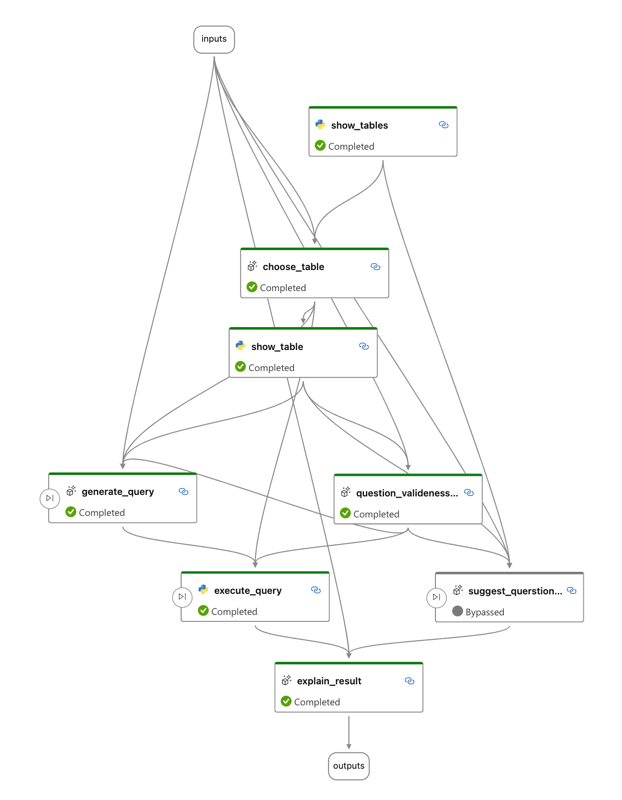
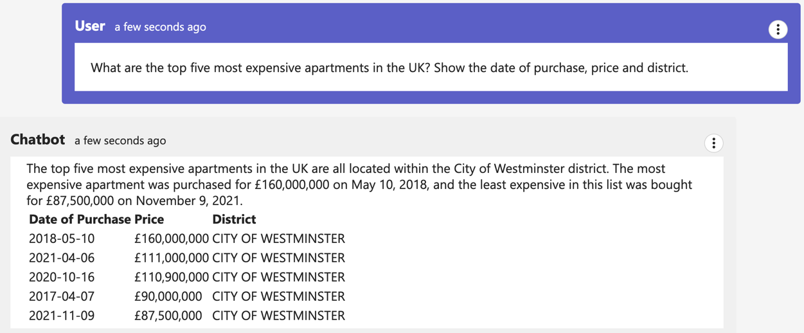

# Ask data

Ask data is a project for asking structured data in a natural language.

## Data source

The project uses [ClickHouse playground](https://play.clickhouse.com/play?user=play) as a data source, because it's
free, fast and easy to use, plus it has variety of datasets from different areas.

Here are some examples of the queries you may ask:
- What's the top five most expensive apartments in the UK?
- What are the months when COVID is most dangerous?
- What is the average length of the taxi trip?
- Who made the most of the contributions to ClickHouse/ClickHouse in the summer 2021
- ...

## Ask data with [promptflow](https://github.com/microsoft/promptflow)

### [DAG](https://microsoft.github.io/promptflow/concepts/concept-flows.html#dag-flow)

DAG (Directed Acyclic Graph) is a simple and natural way to describe a flow for solving a problem.
Promptflow gives us an easy way to build/debug/run/evaluate the flow.
The flow definition looks like this.

Ask questions in the chat.

